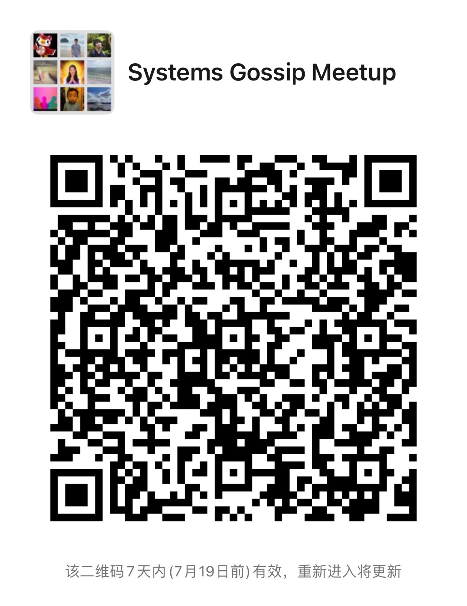

# 22’ Operating Systems Meetup

## Annoucement
- **7/14/2022** 📅 Reminder: Lab 1 Util is due on this **Saturday 7/16/2022 at 5:00 P.M. PST**. We will hold a post-lab happy hour 🎉 on Saturday at the end of our meetup. 
- **7/10/2022** Lab 1 Util Github Classroom has been updated. Please click [here](https://classroom.github.com/a/q4I5zsip) to get a fork. Please remember that **NEVER** share code publically and **NEVER** make the repo public. The first lab is due on 📅 Saturday 7/16/2022. You can directly `git push` to your repo to submit your lab assignment. 
- **7/10/2022** Thanks for joining our first OS meetup! Here are the links we shared:
  - [Mossaka]: recommends a textbook alternative: [Operating Systems, Three Easy Pieces](https://pages.cs.wisc.edu/~remzi/OSTEP/)
  - [Mossaka]: this is a good [article](https://gendignoux.com/blog/2020/06/16/rust-5-years-cross-platform.html#desktop-systems) to learn more about how high-level programming languages like Rust makes cross-platform stdlib.
  - [Morgan Wu]: mentioned [POSIX](https://en.wikipedia.org/wiki/POSIX#POSIX-certified) which is quiet an interesting work.
  - [Mossaka]: Check out [WASI](https://wasi.dev/) (WebAssembly System Interface) to learn how to build a POSIX-like system for WebAssembly that lives on the browser.
  - Post-meetup, we talked about a system interface for the cloud is a missing piece in the modern cloud-era. It would greatly benefit those who want to migrate one cloud to another, or to build cloud-native systems that use both cloud and on-premise, or simply don't want to be locked in to a particular cloud provider (AWS, Azure, GCP, etc.).
  - [go-cloud](https://github.com/google/go-cloud) is an interesting work that provides a "stable, idiomatic interfaces for common uses like storage and databases".
  - Change Data Capture (mentioned in DDIA Chap 11) is another great example of building abstraction on heterogeneous database systems to extract logs out and process them as events. 
  - [David]: mentioned [Debezium](https://debezium.io/), which is an open source distributed platform for change data capture, and it's associated paper [DBlog](https://arxiv.org/pdf/2010.12597v1.pdf)
Next week, Mossaka will present Lecture 2: OS Organization and System Calls. Our lab util is due on Saturday 7/16/2022. We will go through some of the hard questions during the meetup. 
- **7/5/2022:** Our first meetup will be presented by Mossaka and Wen Lin on **July 9th, 2022 at 5:00pm PST**! We will introduce our org, the os-meetup and the schedule. The second half of the meetup, we will introduce operating systems, and discuss **lecture 1** and our reading material **chapter 1**! We call for vonlunteer meetup presenter signups! 
- **6/27/2022:** Our schedule is updated! 
- **5/31/2022:** Our first meetup is scheduled to be held on the **July 9th, 2022** 🎉! We will be learning and discussing [MIT 6.S081 Fall 2021](https://pdos.csail.mit.edu/6.828/2021/schedule.html) together! The schedule, zoom link and other info will be posted soon.
    
    > **Note:** Starting Fall 2020, MIT 6.828 is offered as two courses: [6.S018](https://pdos.csail.mit.edu/6.828/2021/schedule.html) (intro to OS) and [6.828](https://abelay.github.io/6828seminar/index.html) (research focused). 

## Schedule
| Datetime: PST & BJ                                                                                                           | Presenter     | Email                                             | Topic                                            | Material                                                                                                                                                                                                                                                                                                                                                                                                                                                                                                                                                                                                                                                                                                                                                                                                                                                                                                                                                     | Slides                                                                                | Recording                                 |
| ---------------------------------------------------------------------------------------------------------------------------- | ------------- | ------------------------------------------------- | ------------------------------------------------ | ------------------------------------------------------------------------------------------------------------------------------------------------------------------------------------------------------------------------------------------------------------------------------------------------------------------------------------------------------------------------------------------------------------------------------------------------------------------------------------------------------------------------------------------------------------------------------------------------------------------------------------------------------------------------------------------------------------------------------------------------------------------------------------------------------------------------------------------------------------------------------------------------------------------------------------------------------------ | ------------------------------------------------------------------------------------- | ----------------------------------------- |
| 07/09/2022 5:00pm   07/10/2022 8:00am   [Zoom](https://zoom.us/j/92517386662?pwd=eVVxQjZvbzgvbE5uS2ZRbWxOaDZSUT09) | Mossaka & Wen | duibao55238@gmail.com   linwen1991@gmail.com | Administrative and Intro to OS                   | Readings: [Chapter1](https://pdos.csail.mit.edu/6.S081/2021/xv6/book-riscv-rev2.pdf);   Lecture: [Lec 1](https://www.youtube.com/watch?v=L6YqHxYHa7A)                                                                                                                                                                                                                                                                                                                                                                                                                                                                                                                                                                                                                                                                                                                                                                                                   | [Slide Deck](https://github.com/splvm/os-meetup/blob/main/slides/os%20meetup%200.pdf) | [Recording](https://youtu.be/JYFm1fRHBYE) |
| 07/16/2022 5:00pm   07/17/2022 8:00am                                                                                   |               |                                                   |                                                  | Readings: [Chapter 2](https://pdos.csail.mit.edu/6.S081/2021/xv6/book-riscv-rev2.pdf) and   xv6 code: [kernel/proc.h](https://github.com/mit-pdos/xv6-riscv/blob/riscv/kernel/proc.h),   [kernel/defs.h](https://github.com/mit-pdos/xv6-riscv/blob/riscv/kernel/defs.h), [kernel/entry.S](https://github.com/mit-pdos/xv6-riscv/blob/riscv/kernel/entry.S),   [kernel/main.c](https://github.com/mit-pdos/xv6-riscv/blob/riscv/kernel/main.c), [puser/initcode.S](https://github.com/mit-pdos/xv6-riscv/blob/riscv/user/initcode.S),   [user/init.c](https://github.com/mit-pdos/xv6-riscv/blob/riscv/user/init.c), [skim kernel/proc.c](https://github.com/mit-pdos/xv6-riscv/blob/riscv/kernel/proc.c),   [kernel/exec.c](https://github.com/mit-pdos/xv6-riscv/blob/riscv/kernel/exec.c);   Lecture: [Lec 3](https://youtu.be/o44d---Dk4o)   🔴 DUE: [Lab util](https://pdos.csail.mit.edu/6.S081/2021/labs/util.html) | TBD                                                                                   | TBD                                       |
| 07/23/2022 5:00pm   07/24/2022 8:00am                                                                                   |               |                                                   |                                                  | Readings: [Chapter 3](https://pdos.csail.mit.edu/6.S081/2021/xv6/book-riscv-rev2.pdf) and   [kernel/memlayout.h](https://github.com/mit-pdos/xv6-riscv/blob/riscv/kernel/memlayout.h), [kernel/vm.c](https://github.com/mit-pdos/xv6-riscv/blob/riscv/kernel/vm.c),   [kernel/kalloc.c](https://github.com/mit-pdos/xv6-riscv/blob/riscv/kernel/kalloc.c), [kernel/riscv.h](https://github.com/mit-pdos/xv6-riscv/blob/riscv/kernel/riscv.h),   and [kernel/exec.c](https://github.com/mit-pdos/xv6-riscv/blob/riscv/kernel/exec.c);   Lecture: [Lec 4](https://youtu.be/f1Hpjty3TT8)                                                                                                                                                                                                                                                                                                                                                    | TBD                                                                                   | TBD                                       |
| 07/30/2022 5:00pm   07/31/2022 8:00am                                                                                   |               |                                                   |                                                  | Readings: [Chapter 4 except 4.6](https://pdos.csail.mit.edu/6.S081/2021/xv6/book-riscv-rev2.pdf) and   [kernel/riscv.h](https://github.com/mit-pdos/xv6-riscv/blob/riscv/kernel/riscv.h), [kernel/trampoline.S](https://github.com/mit-pdos/xv6-riscv/blob/riscv/kernel/trampoline.S),   and [kernel/trap.c](https://github.com/mit-pdos/xv6-riscv/blob/riscv/kernel/trap.c);   Lecture: [Lec 6](https://youtu.be/T26UuauaxWA)   🔴 DUE: [Lab syscall](https://pdos.csail.mit.edu/6.S081/2021/labs/syscall.html)                                                                                                                                                                                                                                                                                                                                                                                                                          | TBD                                                                                   | TBD                                       |
| 08/06/2022 5:00pm   08/07/2022 8:00am                                                                                   | Lixiang Ao    |                                                   | FaaSnap: FaaS Made Fast Using Snapshot-based VMs | [FaaSnap: FaaS Made Fast Using Snapshot-based VMs](https://dl.acm.org/doi/pdf/10.1145/3492321.3524270)                                                                                                                                                                                                                                                                                                                                                                                                                                                                                                                                                                                                                                                                                                                                                                                                                                                       | TBD                                                                                   | TBD                                       |
| 08/13/2022 5:00pm   08/14/2022 8:00am                                                                                   |               |                                                   |                                                  | Readings: [Section 4.6](https://pdos.csail.mit.edu/6.S081/2021/xv6/book-riscv-rev2.pdf);   Lecture: [Lec 7](https://youtu.be/KSYO-gTZo0A)   🔴 DUE: [Lab pgtbl](https://pdos.csail.mit.edu/6.S081/2021/labs/pgtbl.html)                                                                                                                                                                                                                                                                                                                                                                                                                                                                                                                                                                                                                                                                                                                             | TBD                                                                                   | TBD                                       |
| 08/20/2022 5:00pm   08/21/2022 8:00am                                                                                   |               |                                                   |                                                  | Readings: [Chapter 5](https://pdos.csail.mit.edu/6.S081/2021/xv6/book-riscv-rev2.pdf)   and [kernel/kernelvec.S](https://github.com/mit-pdos/xv6-riscv/blob/riscv/kernel/kernelvec.S), [kernel/plic.c](https://github.com/mit-pdos/xv6-riscv/blob/riscv/kernel/plic.c),   [kernel/console.c](https://github.com/mit-pdos/xv6-riscv/blob/riscv/kernel/console.c), [kernel/uart.c](https://github.com/mit-pdos/xv6-riscv/blob/riscv/kernel/uart.c),   [kernel/printf.c](https://github.com/mit-pdos/xv6-riscv/blob/riscv/kernel/printf.c)   Lecture: [Lec 9](https://youtu.be/zRnGNndcVEA)                                                                                                                                                                                                                                                                                                                                                 | TBD                                                                                   | TBD                                       |
| 08/27/2022 5:00pm   08/28/2022 8:00am                                                                                   |               |                                                   |                                                  | Readings:["Locking"](https://pdos.csail.mit.edu/6.S081/2021/xv6/book-riscv-rev2.pdf) with [kernel/spinlock.h](https://github.com/mit-pdos/xv6-riscv/blob/riscv/kernel/spinlock.h) and [kernel/spinlock.c](https://github.com/mit-pdos/xv6-riscv/blob/riscv/kernel/spinlock.c),   Lecture: [Lec 10](https://youtu.be/NGXu3vN7yAk)   🔴 DUE: [Lab traps](https://pdos.csail.mit.edu/6.S081/2021/labs/traps.html)                                                                                                                                                                                                                                                                                                                                                                                                                                                                                                                                      | TBD                                                                                   | TBD                                       |
| 09/03/2022 5:00pm   09/04/2022 8:00am                                                                                   |               |                                                   |                                                  | Readings:["Scheduling"](https://pdos.csail.mit.edu/6.S081/2021/slides/6s081-lec-threads.pdf) through Section 7.4, and [kernel/proc.c](https://github.com/mit-pdos/xv6-riscv/blob/riscv/kernel/proc.c), [kernel/swtch.S](https://github.com/mit-pdos/xv6-riscv/blob/riscv/kernel/swtch.S), Lecture: [Lec 11](https://www.youtube.com/watch?v=vsgrTHY5tkg)                                                                                                                                                                                                                                                                                                                                                                                                                                                                                                                                                                                                     | TBD                                                                                   | TBD                                       |
| 09/10/2022 5:00pm   09/11/2022 8:00am                                                                                   |               |                                                   |                                                  |                                                                                                                                                                                                                                                                                                                                                                                                                                                                                                                                                                                                                                                                                                                                                                                                                                                                                                                                                              | TBD                                                                                   | TBD                                       |
| 09/17/2022 5:00pm   09/18/2022 8:00am                                                                                   |               |                                                   |                                                  | Readings:remainder of ["Scheduling"](https://pdos.csail.mit.edu/6.S081/2021/xv6/book-riscv-rev2.pdf), and corresponding parts of [kernel/proc.c](https://github.com/mit-pdos/xv6-riscv/blob/riscv/kernel/proc.c), [kernel/sleeplock.c](https://github.com/mit-pdos/xv6-riscv/blob/riscv/kernel/sleeplock.c), Lecture: [Lec 12](https://youtu.be/gP67sJ4PTnc)   🔴 DUE: [Lab cow](https://pdos.csail.mit.edu/6.S081/2021/labs/cow.html)                                                                                                                                                                                                                                                                                                                                                                                                                                                                                                                   | TBD                                                                                   | TBD                                       |
| 09/24/2022 5:00pm   09/25/2022 8:00am                                                                                   |               |                                                   |                                                  | Readings:[kernel/bio.c](https://github.com/mit-pdos/xv6-riscv/blob/riscv/kernel/bio.c), [kernel/fs.c](https://github.com/mit-pdos/xv6-riscv/blob/riscv/kernel/fs.c), [kernel/sysfile.c](https://github.com/mit-pdos/xv6-riscv/blob/riscv/kernel/sysfile.c), [kernel/file.c](https://github.com/mit-pdos/xv6-riscv/blob/riscv/kernel/file.c) and ["File system"](https://pdos.csail.mit.edu/6.S081/2021/xv6/book-riscv-rev2.pdf) (except for the logging sections), Lecture: [Lec 14](https://youtu.be/ADzLv1nRtR8)                                                                                                                                                                                                                                                                                                                                                                                                                                           | TBD                                                                                   | TBD                                       |
| 10/01/2022 5:00pm   10/02/2022 8:00am                                                                                   |               |                                                   |                                                  | Readings:[kernel/log.c](https://github.com/mit-pdos/xv6-riscv/blob/riscv/kernel/log.c) and the logging sections of "File system", Lecture: [Lec 15](https://youtu.be/7Hk2dIorDkk)   🔴 DUE: [Lab thread](https://pdos.csail.mit.edu/6.S081/2021/labs/thread.html)                                                                                                                                                                                                                                                                                                                                                                                                                                                                                                                                                                                                                                                                                        | TBD                                                                                   | TBD                                       |
| 10/08/2022 5:00pm   10/09/2022 8:00am                                                                                   |               |                                                   |                                                  | Readings:[Journaling the Linux ext2fs Filesystem (1998)](https://pdos.csail.mit.edu/6.S081/2021/readings/journal-ext2fs.html), Lecture: [Lec 16](https://youtu.be/CmDcf6rjFb4)                                                                                                                                                                                                                                                                                                                                                                                                                                                                                                                                                                                                                                                                                                                                                                               | TBD                                                                                   | TBD                                       |
| 10/15/2022 5:00pm   10/16/2022 8:00am                                                                                   |               |                                                   |                                                  |                                                                                                                                                                                                                                                                                                                                                                                                                                                                                                                                                                                                                                                                                                                                                                                                                                                                                                                                                              | TBD                                                                                   | TBD                                       |
| 10/22/2022 5:00pm   10/23/2022 8:00am                                                                                   |               |                                                   |                                                  | Readings:[Virtual Memory Primitives for User Programs (1991)](https://pdos.csail.mit.edu/6.S081/2021/readings/appel-li.pdf), Lecture: [Lec 17](https://youtu.be/YNQghIvk0jc)   🔴 DUE: [Lab net](https://pdos.csail.mit.edu/6.S081/2021/labs/net.html)                                                                                                                                                                                                                                                                                                                                                                                                                                                                                                                                                                                                                                                                                                   | TBD                                                                                   | TBD                                       |
| 10/29/2022 5:00pm   10/30/2022 8:00am                                                                                   |               |                                                   |                                                  | Readings:[The Performance of micro-Kernel-Based Systems (1997)](https://pdos.csail.mit.edu/6.S081/2021/readings/microkernel.pdf), Lecture: [Lec 18](https://youtu.be/dM9PLdaTpnA)                                                                                                                                                                                                                                                                                                                                                                                                                                                                                                                                                                                                                                                                                                                                                                            | TBD                                                                                   | TBD                                       |
| 11/05/2022 5:00pm   11/06/2022 8:00am                                                                                   |               |                                                   |                                                  | Readings:[Dune: Safe User-level Access to Privileged CPU Features (2012)](https://pdos.csail.mit.edu/6.S081/2021/readings/belay-dune.pdf), Lecture: [Lec 19](https://youtu.be/R8obXHAIPY0)                                                                                                                                                                                                                                                                                                                                                                                                                                                                                                                                                                                                                                                                                                                                                                   | TBD                                                                                   | TBD                                       |
| 11/12/2022 5:00pm   11/13/2022 9:00am                                                                                   |               |                                                   |                                                  | Readings:[the Biscuit paper (2018)](https://pdos.csail.mit.edu/6.S081/2021/readings/biscuit.pdf), Lecture: [Lec 20](https://youtu.be/AAtXWGwxI9k)   🔴 DUE: [Lab lock](https://pdos.csail.mit.edu/6.S081/2021/labs/lock.html)                                                                                                                                                                                                                                                                                                                                                                                                                                                                                                                                                                                                                                                                                                                            | TBD                                                                                   | TBD                                       |
| 11/19/2022 5:00pm   11/20/2022 9:00am                                                                                   |               |                                                   |                                                  |                                                                                                                                                                                                                                                                                                                                                                                                                                                                                                                                                                                                                                                                                                                                                                                                                                                                                                                                                              | TBD                                                                                   | TBD                                       |
| 12/03/2022 5:00pm   12/04/2022 9:00am                                                                                   |               |                                                   |                                                  | Readings:[Receive Livelock (1996)](https://pdos.csail.mit.edu/6.S081/2021/readings/mogul96usenix.pdf), Lecture: [Lec 21](https://youtu.be/Fcjychg4Tvk)   🔴 DUE: [Lab fs](https://pdos.csail.mit.edu/6.S081/2021/labs/fs.html)                                                                                                                                                                                                                                                                                                                                                                                                                                                                                                                                                                                                                                                                                                                           | TBD                                                                                   | TBD                                       |
| 12/10/2022 5:00pm   12/11/2022 9:00am                                                                                   |               |                                                   |                                                  | Readings:[Meltdown (2018)](https://pdos.csail.mit.edu/6.S081/2021/readings/meltdown.pdf), Lecture: [Lec 22](https://youtu.be/WpKVr3p5rjE)                                                                                                                                                                                                                                                                                                                                                                                                                                                                                                                                                                                                                                                                                                                                                                                                                    | TBD                                                                                   | TBD                                       |
| 12/17/2022 5:00pm   12/18/2022 9:00am                                                                                   |               |                                                   |                                                  |                                                                                                                                                                                                                                                                                                                                                                                                                                                                                                                                                                                                                                                                                                                                                                                                                                                                                                                                                              | TBD                                                                                   | TBD                                       |
| 01/07/2023 5:00pm   01/08/2023 9:00am                                                                                   |               |                                                   |                                                  | Readings:[RCU paper (2013)](https://pdos.csail.mit.edu/6.S081/2021/readings/rcu-decade-later.pdf), Lecture: [Lec 23](https://youtu.be/KUwyCGMTeq8)                                                                                                                                                                                                                                                                                                                                                                                                                                                                                                                                                                                                                                                                                                                                                                                                           | TBD                                                                                   | TBD                                       |
| 01/14/2023 5:00pm   01/15/2023 9:00am                                                                                   |               |                                                   |                                                  | Readings:[NASA CALIPSO paper (2006)](https://pdos.csail.mit.edu/6.S081/2021/readings/nasa-calipso-radiation.pdf) for background   🔴 DUE: [Lab mmap](https://pdos.csail.mit.edu/6.S081/2021/labs/mmap.html)                                                                                                                                                                                                                                                                                                                                                                                                                                                                                                                                                                                                                                                                                                                                              | TBD                                                                                   | TBD                                       |

## Misc
- Labs
  - [Lab 1: Util](https://classroom.github.com/a/q4I5zsip)
- [Join Slack](https://join.slack.com/t/splvm/shared_invite/zt-11c7tkyoy-gNOtZWwSZsE2UFOtXBw2Wg) for async discussion
- If you wish to join 微信 (WeChat), please scan 
- 
- [MIT 6.S081 website](https://pdos.csail.mit.edu/6.S081/2021/index.html)
- [Textbook: xv6](https://pdos.csail.mit.edu/6.S081/2021/xv6/book-riscv-rev2.pdf)
- The C programming language (second edition) by Kernighan and Ritchie. Prentice Hall, Inc., 1988. ISBN 0-13-110362-8, 1998.
- [Operating Systems, Three Easy Pieces](https://pages.cs.wisc.edu/~remzi/OSTEP/)
- Alternative courses
  - [Berkeley cs162](https://cs162.org/)
  - [Stanford cs140e](https://cs140e.sergio.bz/). A course about Operating Systems with all labs in Rust 🦀
- [Distributed Systems Meetup](https://splvm.github.io/distsys-meetup/)
- [Database Systems Meetup](https://splvm.github.io/database-meetup/)

## Sponsors
> The organizers spent a lot of time and effort to make this meetup possible. If you would like to sponsor this meetup, please contact us at `systemsgossip at gmail dot com`

We would like to thank the following sponsors for their support:

## FAQ
1. Do you have recordings for each meetup?

A: Absolutely yes! you can find all our recordings in this [playlist](https://youtube.com/playlist?list=PLckH3KfeRMe5zFGaqpB15StSTR92dp9tS)

